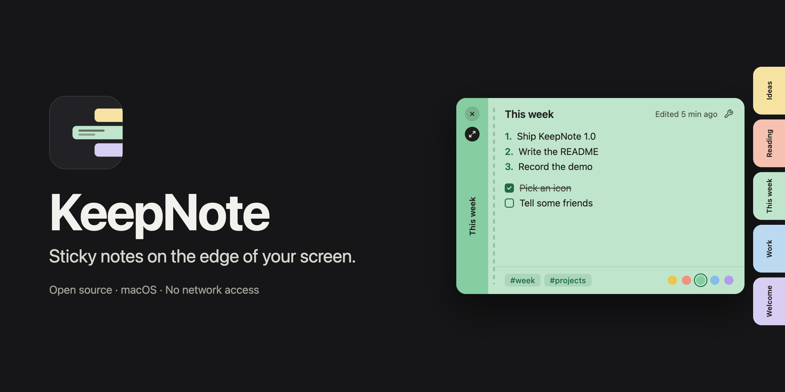
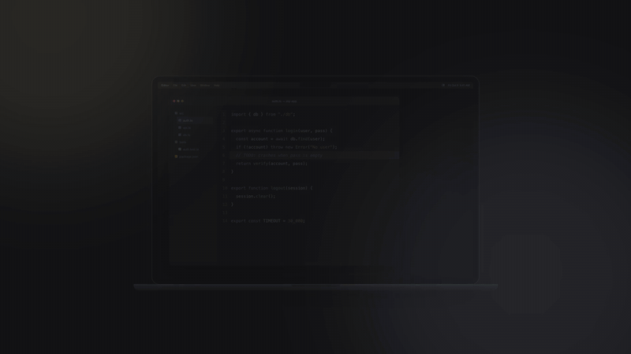

<p align="right"><a href="README.pt-BR.md">Português</a></p>



<p align="center"><a href="https://colletpedro.github.io/keepnote/"><br>Watch the full video</a></p>

# KeepNote

Sticky notes for macOS that wait as a row of colored tabs on the right edge of your screen: move the cursor there, pick a note, write, and it slides back out of the way.

**[Download KeepNote.dmg](https://github.com/colletpedro/keepnote/releases/latest/download/KeepNote.dmg)**

Requires a Mac with an Apple chip (M1 or later) and macOS 13 or newer. The download is built for Apple chips only.

## Install

**1. Open the download and drag KeepNote onto Applications.**

**2. Open KeepNote from Applications.** macOS will say it could not verify the app. Click **Done** (or **OK**). This is expected; [the reason is below](#why-does-macos-show-a-warning).

**3. Allow it once.** Open **System Settings → Privacy & Security**, scroll to **Security**, click **Open Anyway** next to KeepNote, and confirm. macOS will not ask again for this copy of the app. (On macOS 13 and 14 you can also Control-click the app and choose **Open**.)

## Why does macOS show a warning?

KeepNote is not notarized by Apple. Notarization needs a paid Apple Developer membership (US$ 99 a year), and KeepNote is a free, open-source project, so it ships without it for now. macOS shows this warning for every app that has not been through that process. It says Apple has not checked the app, not that something is wrong with it. These are the four things you can check for yourself instead:

1. **You can read it, and build it.** All of the source code is in this repository, with no third-party libraries. `./Scripts/build.sh` builds the same app from it.
2. **It cannot use the network.** KeepNote runs in the macOS sandbox without the network entitlements, so the system refuses any connection it tried to make. See for yourself: `codesign -d --entitlements - /Applications/KeepNote.app` lists no network access.
3. **It only reaches what you give it.** Outside its own container, the sandbox lets KeepNote open only the folders and files you pick, for sync, import and export. The text of your notes is encrypted on disk with a key that stays in this Mac's Keychain.
4. **You can check the download.** Each release carries a `KeepNote.dmg.sha256` file. `shasum -a 256 KeepNote.dmg` must print the same value.

## What it does

- **A deck on the screen edge.** Notes are tabs on the right edge. Hovering the edge fans them out, each with its own color and label; the deck scrolls when there are many. Touching a tab shows a quick look at the note without taking focus from the app you are in; clicking opens it for editing.
- **Anchored or floating.** An open note is anchored to the deck and closes when you click elsewhere. **Float Note** (⌥⌘P) lifts it off the edge so it stays on screen, resizable, and remembers its place; dragging a floating note back to the edge returns it.
- **Markdown as you type.** Bold, italic, strikethrough, highlight, links, headings, bulleted, numbered and checklist items (with indent and automatic renumbering), quotes, code, tables and dividers, all with shortcuts and in a Tools menu in the note.
- **Colors and tags.** Five paper colors, changeable at any moment, and `#tags` with suggestions while you type. All Notes filters by tag and searches title, tags and text.
- **Daily notes.** Give a note the `daily` tag, or use **Today's Daily** (⌥⌘Y, or the calendar button on the deck). The deck keeps the dailies of your two most recent days; older ones are archived and stay under **Daily** in All Notes, grouped by day. You can set a template for new daily notes.
- **Pin, keep and archive by time.** *Pin to Center* holds up to five notes in the middle of the deck, always whole. *Keep on Deck* exempts a note from archiving. Notes you have not opened for 7, 14 or 30 days (you choose; 14 by default) move to the Archive on their own, never deleted; in the last two days a clock appears on the tab. Pinning, keeping and the archiving rules do not change a note's *Edited* date, which only moves when you change its text or title.
- **Archive and undo.** Archived notes have their own window. Deleting a note gives you 10 seconds (adjustable) to undo it.
- **Sync through a folder.** Optionally, KeepNote writes one plain-text `.hmnote` file per note into a folder you choose (iCloud Drive is suggested). The folder's provider moves them between Macs; KeepNote has no server of its own.
- **Import and export.** Export notes as Markdown or plain text, one file per note or one document, or as a KeepNote archive (`.hmnotearchive`) that keeps colors, states and dates. Import reads that archive or a folder of `.hmnote` files.
- **Where it lives.** In the menu bar, and in the Dock only while one of its windows is open. Optional launch at login and display over full-screen apps.

## Build from source

You need only Apple's Command Line Tools (`xcode-select --install`), or Xcode. KeepNote has no dependencies beyond the system frameworks.

```bash
git clone https://github.com/colletpedro/keepnote.git
cd keepnote
./Scripts/build.sh --run
```

That builds the app into `build/` and opens it. On a fresh clone there is no signing certificate, so the build is signed **ad-hoc** and prints a visible warning. An ad-hoc signature changes with every build, so after each rebuild macOS asks again for access to the Keychain item holding the key that encrypts your notes; choose Allow, no notes are lost.

To stop those prompts, create a signing certificate once: in Keychain Access, **Certificate Assistant → Create a Certificate…**, name it **KeepNote Dev**, identity type **Self-Signed Root**, certificate type **Code Signing**. The build uses it automatically from then on. Another certificate works with `KEEPNOTE_SIGN_ID="Name"`.

| Command | What it does |
|---|---|
| `./Scripts/build.sh` | debug build into `build/` |
| `./Scripts/build.sh --release` | optimized build |
| `./Scripts/build.sh --install` | release build, replaces `/Applications/KeepNote.app` (refuses an ad-hoc build unless `KEEPNOTE_ALLOW_ADHOC=1`) |
| `./Scripts/release.sh` | arm64 release signed with `KEEPNOTE_SIGN_ID`, packed into `dist/KeepNote.dmg` with its `.sha256` |
| `./Scripts/test.sh` | the test suites; they use temporary databases and never touch your notes |

`KEEPNOTE_SDK=/path/to/MacOSX.sdk` overrides the SDK the build picks.

## Shortcuts

| Global, from any app | What it does |
|---|---|
| `⌥⌘N` | New note |
| `⌥⌘A` | All Notes |
| `⌥⌘E` | Archive |
| `⌥⌘Y` | Today's Daily |

| In a note | What it does |
|---|---|
| `esc` | Close |
| `⌘F` | Find in the note |
| `⌘G` / `⇧⌘G` | Next / previous match |
| `⌥⌘C` | Next color |
| `⌥⌘P` | Float Note / Return to Deck |
| `⇧⌘E` | Archive / bring back |
| `⇧⌘⌫` | Delete (undoable) |
| `⇥` / `⇧⇥` | Indent / outdent a list item |

| Formatting | What it does |
|---|---|
| `⌘B` `⌘I` `⇧⌘X` | Bold, italic, strikethrough |
| `⇧⌘H` | Highlight |
| `⌘E` | Inline code |
| `⌘K` | Link |
| `⌥⌘1` `⌥⌘2` `⌥⌘3` | Heading 1, 2, 3 |
| `⇧⌘7` `⇧⌘9` `⇧⌘L` | Bulleted list, numbered list, checklist |
| `⇧⌘B` | Quote |
| `⌥⌘K` | Code block |
| `⌥⌘T` `⌥⌘R` | Table, divider |
| `⇧⌘D` | Today's date |

## Privacy

KeepNote makes no network connection. It has no server, account, telemetry or analytics, and its entitlements (`Resources/KeepNote.entitlements`) are the sandbox, folders you choose, and bookmarks to them, nothing more. A link inside a note opens in your browser.

The text of your notes is encrypted in the local database (AES-GCM) with a key kept in this Mac's Keychain, which never leaves it and is not synced. Note titles and tags are stored unencrypted so they can be searched; the synced `.hmnote` files are plain text, so they stay readable without the app and are protected by whatever protects the folder.

The database lives at `~/Library/Containers/com.keepnote.KeepNote/Data/Library/Application Support/KeepNote/notes.sqlite`.

## License

MIT. See [LICENSE](LICENSE).
